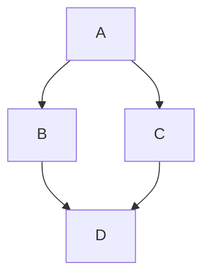

Here is a comprehensive response designed to act as a **stress test** for your Qt-based Markdown parser. This includes standard CommonMark syntax, GitHub Flavored Markdown (GFM), and common edge cases typical of LLM outputs.

***

Hello! I am ready to help you stress-test your Markdown parser. Below is a comprehensive collection of formatting styles, code blocks, and structural elements that I might generate during a conversation.

# Level 1 Heading
## Level 2 Heading
### Level 3 Heading
#### Level 4 Heading
##### Level 5 Heading
###### Level 6 Heading

### 1. Text Formatting
Here is a demonstration of inline styles:
*   **Bold text using asterisks** or __bold using underscores__.
*   *Italic text using asterisks* or _italic using underscores_.
*   ***Bold and Italic combined***.
*   ~~Strikethrough text~~ to indicate deletions.
*   `Inline code` for mentioning variables like `int x = 10;`.
*   Escaped characters: \*literal asterisks\* and \[brackets\].

### 2. Lists and Nesting

**Unordered List:**
*   Item 1
*   Item 2
    *   Indented Item 2.1
    *   Indented Item 2.2
        *   Deep nesting 2.2.1
*   Item 3

**Ordered List:**
1.  First step
2.  Second step
    1.  Sub-step A
    2.  Sub-step B
3.  Third step

**Task List (GitHub Flavor):**
- [x] Completed task
- [ ] Incomplete task
- [ ] Task with **bold** text inside

### 3. Code Blocks
A generic code block (no language specified):
```
This is raw text.
No syntax highlighting should appear here.
```

A **Python** code block with syntax highlighting:
```python
def hello_world():
    # This is a comment
    print("Hello, Qt!")
    return True
```

A **C++** code block (relevant for your Qt app):
```cpp
#include <QApplication>
#include <QPushButton>

int main(int argc, char *argv[]) {
    QApplication app(argc, argv);
    QPushButton button("Click Me");
    button.show();
    return app.exec();
}
```

A **Diff** block (often used to show code changes):
```diff
- old_variable = 10
+ new_variable = 20
  unchanged_line = 5
```

### 4. Blockquotes
> This is a blockquote.
> AI models often use these to summarize text.
>
> > This is a nested blockquote.
> > It tests your parser's indentation logic.

### 5. Tables
Tables are tricky for many parsers. Check alignment and border rendering.

| ID | Name | Role | Alignment |
| :--- | :---: | :---: | ---: |
| 1 | **Alice** | Admin | Right |
| 2 | Bob | User | `Aligned` |
| 3 | Charlie | *Guest* | $100 |

### 6. Links and Images
*   **Standard Link:** [OpenAI](https://openai.com)
*   **Link with Title:** [Hover Me](https://example.com "This is a tooltip")
*   **Autolink:** https://www.google.com
*   **Image:**
    

### 7. Mathematical Formulas (LaTeX)
If your chatbot supports math (common in AI), you need to render LaTeX.

**Inline math:** $E = mc^2$
**Block math:**
$$
\sum_{i=0}^n i^2 = \frac{(n^2+n)(2n+1)}{6}
$$

### 8. Horizontal Rules
Three ways to make a divider:
---
***
___

### 9. Edge Cases & "Torture" Test
**Mixed HTML (If supported):**
Type <kbd>Ctrl</kbd> + <kbd>C</kbd> to copy.

**Long lines without breaks:**
ThisIsAVeryLongStringThatShouldWrapCorrectlyInYourUIAndNotBreakTheLayoutOrCauseHorizontalScrollingUnlessYouSpecificallyIntendForItToDoSoBecauseThatIsBadUX.

**Zero-width spaces or weird nesting:**
1. List item
   ```python
   print("Code inside list")
   ```
2. Back to list

**Mermaid Diagram (If supported):**


***

**End of Output.** Does your parser render the separator above correctly?

***

### 🛠 Developer Note for your Qt App:

When parsing this in Qt, pay attention to these specific common failures:

1.  **`QTextDocument` limitations:** If you are using `QTextDocument::setMarkdown()`, be aware it supports CommonMark but often fails on GitHub Flavored Markdown (GFM) tables and task lists (checkboxes).
2.  **Code Block Backgrounds:** Ensure your stylesheet (`QSS`) distinguishes between inline code background and code block background.
3.  **Image Sizing:** Standard Markdown doesn't specify image size. In Qt, you often need to intercept the image loading to scale it to the viewport width so it doesn't blow up your layout.
4.  **MathJax:** Qt does not natively render `$$` LaTeX. You will likely need a web-view or a custom renderer (like `QTextObjectInterface`) to draw the math.